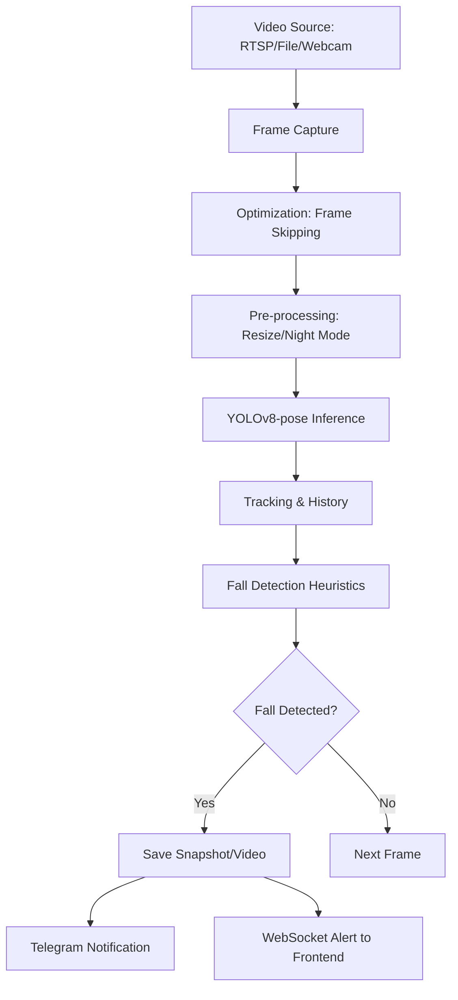

# System Architecture Overview

This document describes the technical architecture and optimizations of the Fall Detection System.

## 1. High-Level Architecture

The system follows a modern decoupled architecture:

- **Frontend**: React (Vite) SPA. Handles visualization, camera management, and real-time event alerts via WebSockets.
- **Backend**: FastAPI (Python). Manages the CV pipeline, database (PostgreSQL), and provides a REST API for the frontend.
- **CV Pipeline**: Multi-threaded processing using YOLOv8-pose for real-time human pose estimation and fall detection heuristics.
- **Database**: PostgreSQL for storing camera configurations, groups, and fall events.

## 2. CV Pipeline Flow

## 3. Performance Optimizations (Low-End Hardware)

To target machines with **1-1.5GB RAM** and **no GPU**, the following optimizations are implemented:

- **Frame Skipping**: The system processes 1 out of every 3 frames (effectively 10 FPS for a 30 FPS source). This reduces CPU load by 66% while maintaining enough temporal data for velocity calculations.
- **Input Resizing**: All frames are resized to `640px` (imgsz=640) before inference, significantly reducing memory footprint and computation time.
- **Efficient Tracking**: Uses YOLOv8's built-in tracker with persistence to maintain identity across frames without expensive re-identification.
- **Memory Management**: Uses `deque` with fixed maximum lengths for frame buffers and tracking history to prevent memory leaks.
- **Asynchronous I/O**: FastAPI handles API requests and WebSocket streaming asynchronously, ensuring the UI remains responsive even during heavy CV processing.

## 4. Notification System

- **Dynamic Configuration**: Each camera group can have its own Telegram `bot_token` and `chat_id`.
- **Media Alerts**: Notifications include a snapshot image and a short video clip of the detected fall event.
